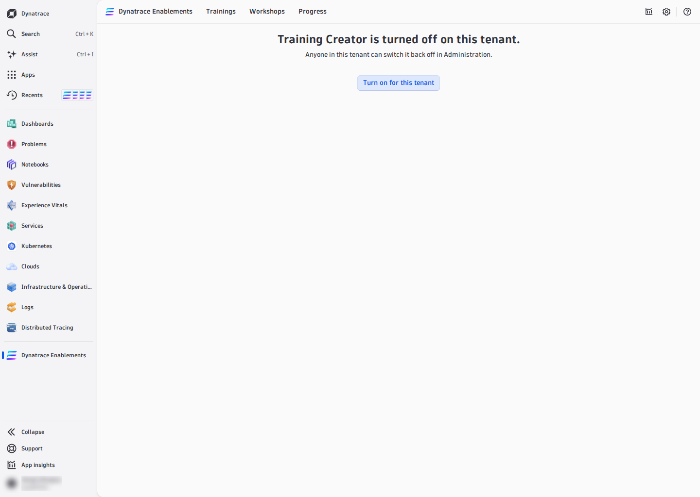

# 00 — Getting Started

Everything in this training happens **inside the Dynatrace Enablement app**: you write, run, test and ship a training in the app's **training editor**. You need a Dynatrace tenant with the app, a GitHub account, and a browser — nothing else. No VS Code, no Codespace.

---

## 1. Install the app

Go to Orbital and **register your tenant with an account OAuth client** — the required scopes are listed on the page:

**[autonomous-enablements.whydevslovedynatrace.com/#register](https://autonomous-enablements.whydevslovedynatrace.com/#register)**

The app installs in your tenant as **Dynatrace Enablement**. Orbital uses the client once to install the app and store it in the tenant for token minting and self-updates; Orbital itself keeps nothing.

!!! tip "No tenant of your own?"
    Use the **SE sandbox tenant** — the app is already deployed there.

## 2. Turn on the Training Creator

The editor is the **Editor** entry in the app's header, after *Progress*. It is switched **per tenant, by anyone in it**, and it is **off by default**. Open **Editor**; on a tenant where it is off the page reads *Training Creator is turned off on this tenant.* Press **Turn on for this tenant**.

You can switch it on or off again at any time under **Administration → Training Creator**, which also shows who changed it last.

!!! note "No Editor entry in the header?"
    The Editor entry only appears where the platform offers the training editor. If your tenant shows none — or the page says *The training editor is not available on this environment* — use a tenant where it is offered, or build the training the classic way described in the [appendix](outside-the-app.md).

## 3. Connect GitHub

Your training is a GitHub repository, and the editor commits to it **as you**. In the editor's top right corner press **Sign in to GitHub** and approve the GitHub window that opens. Once connected, your GitHub handle (*@you*) sits in the top right corner, next to **Disconnect**.

To push to a repository, the editor's GitHub App must be installed on the repository's owner. When it is not, the editor says so and offers **Install App on &lt;owner&gt;** — or a fork to your own account (see [01 — Open or Fork a Training](open-a-training.md)).

## 4. Take Kubernetes 101 as a learner

Open **Trainings** and run **Kubernetes 101** from start to finish. This is the most important step: it shows you the learner experience you are about to build — the terminal, the checks, the quizzes, the DQL validations and the progress tracking. (The *Show solution* / *Run solution* buttons appear for trainers; learners see them only when a tenant admin turns on **Enable solutions**.)

## 5. The flow from here

Each of the next pages is one thing you do in the editor, in the order you do it:

| Page | In the editor |
|---|---|
| [01 — Open or Fork a Training](open-a-training.md) | the entry selector: a training, its branches, **Fork**, **Create branch**, **+ Import from URL** |
| [02 — Start the Environment](start-environment.md) | **Start environment**, the Workspace, **Open terminal**, the Provisioning Log |
| [03 — Command Center](command-center.md) | run a command, pick a framework function, run DQL |
| [04 — Write and Test Steps](write-and-test.md) | **Source / Preview / Split**, **Insert**, **Problems**, **Test step**, **Run test**, **Run validation** |
| [05 — Recreate the Environment](recreate-environment.md) | **Recreate container**, **Recreate from branch**, **Restart** |
| [06 — Commit and Open a PR](commit-and-pr.md) | **Commit**, **History**, **Create PR** |
| [07 — Test as a Learner](test-as-learner.md) | **Preview for learners**, then the merged training |

The **Reference** pages ([How It Works](01-how-it-works.md), [Automate the Environment](02-automation.md), [Lesson Anatomy](03-lesson-anatomy.md), [Interactive Blocks](04-interactive-blocks.md), [Example Lesson](05-example-lesson.md)) explain *what* you write; the flow pages explain *where* you write and test it.

---

## First check: is your environment up?

This template is itself an interactive training. The check below runs in *your* container — it is the same `checkNodeReady` helper you will find in `my_functions.sh`:

<!-- LAB_QUESTION
type: shell-verification
question: "Verify the k3d cluster is running in your environment"
buttonText: "Check Cluster"
command: "checkNodeReady"
expect:
  operator: exit-zero
hint: "The cluster is started by post-create.sh. Wait a minute after the environment starts and try again."
explanation: "The cluster is Ready — post-create.sh did its job."
-->

<!-- LAB_NO_SOLUTION: provisioning sanity check — post-create.sh builds the cluster, there is nothing for the learner to fix -->

- [01 — Open or Fork a Training :octicons-arrow-right-24:](open-a-training.md)

