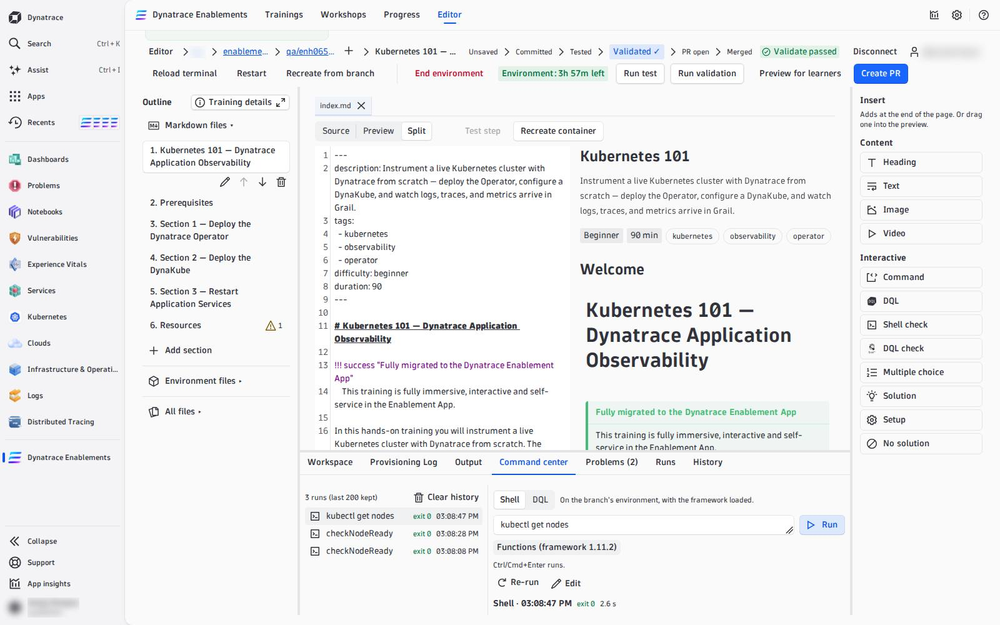
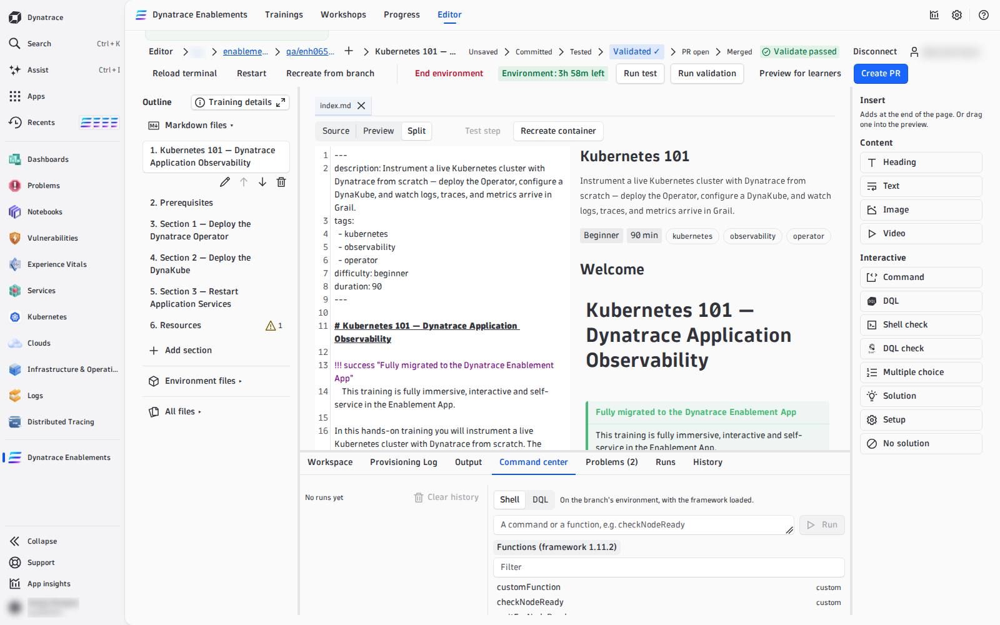

# 03 — Command Center

The **Command center** tab in the dock is where you try things before you write them into a step: any shell command, any framework function, any function from your `my_functions.sh`, or any DQL query. It is the editor's scratchpad.

---

## Run a shell command

Choose **Shell**, type a command and press **Run** (or Ctrl/Cmd+Enter). It runs in your branch's environment **with the framework loaded**, exactly the way a check or a solution will run for a learner — so a command that passes here passes in the step.

- The result shows the **exit code** — `exit 0` green, anything else red — and the output, stderr in red.
- **Stop** cancels a command that runs too long.
- Unsaved edits are written into the environment first, so a function you just changed in `my_functions.sh` is the one that runs.
- Without a running environment, Run is disabled with *Start the environment to run shell commands.*

## Pick a framework function

Under the input, **Functions (framework &lt;version&gt;)** opens a filterable list of every function your training can call: first the ones from your own `my_functions.sh`, marked **custom**, then the framework's — read at exactly the framework version your training pins in `.devcontainer/util/source_framework.sh`, so you are never offered a function your training does not have.

Picking a name puts it into the input; it never runs it. Press **Run** when you are ready. Full descriptions of the framework functions: [Functions Reference](https://dynatrace-wwse.github.io/codespaces-framework/functions/) and [Automate the Environment](02-automation.md#framework-functions-you-will-use).

## Run DQL

Choose **DQL**, write a query and press **Run**. It runs against **your tenant** — the one the environment's tokens were minted in — and shows the records as a table (or chart). Grail's own error message is shown verbatim, position included. No environment is needed for DQL.

Use it to build a `dql-verification` check: write the query here, with your own session id in place of `{{DT_SESSION_ID}}` (the **Variables** list in the Workspace tab shows it), until it returns rows *after* the step and none *before*. Then put it into the step with the template variable — see [Template variables](04-interactive-blocks.md#template-variables-one-query-every-learner-isolated).

## History

Every run is kept in the **history** on the left — newest first, with its exit code or record count and time, up to 200 per branch, in this browser only. Pick one to see its output again, then **Re-run** it or **Edit** it back into the input. **Clear history** empties it.

!!! warning "Tokens are masked, not hidden from the environment"
    Dynatrace token values in the output and in the history are masked (`dt0c01.**** (masked)`). A command that contains a token is sent as typed but stored masked, so it cannot be re-run from the history — use **Edit** and paste the token again.

## The terminal is still there

For anything interactive — `k9s`, following logs, editing a file in place — use **Open terminal** in the Workspace tab: a real shell in a new window. The Command center is for commands you want to keep, compare and turn into steps.

<!-- LAB_NO_SOLUTION: editor walkthrough — nothing in the environment changes -->

- [04 — Write and Test Steps :octicons-arrow-right-24:](write-and-test.md)

