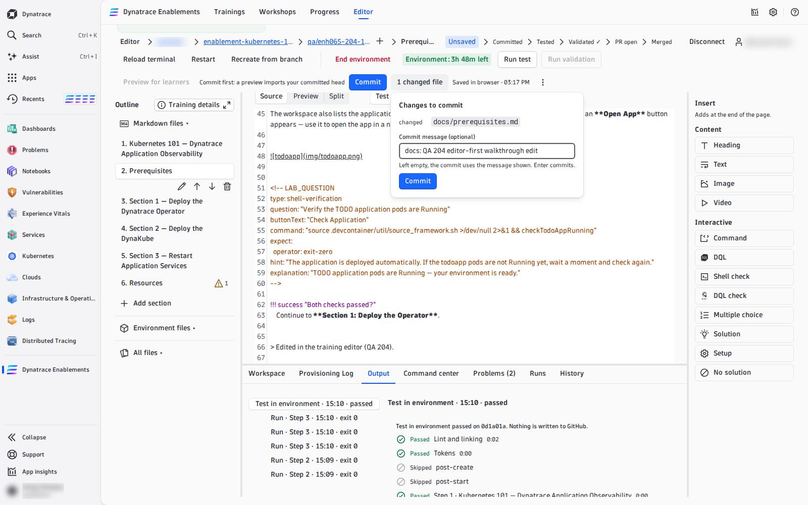
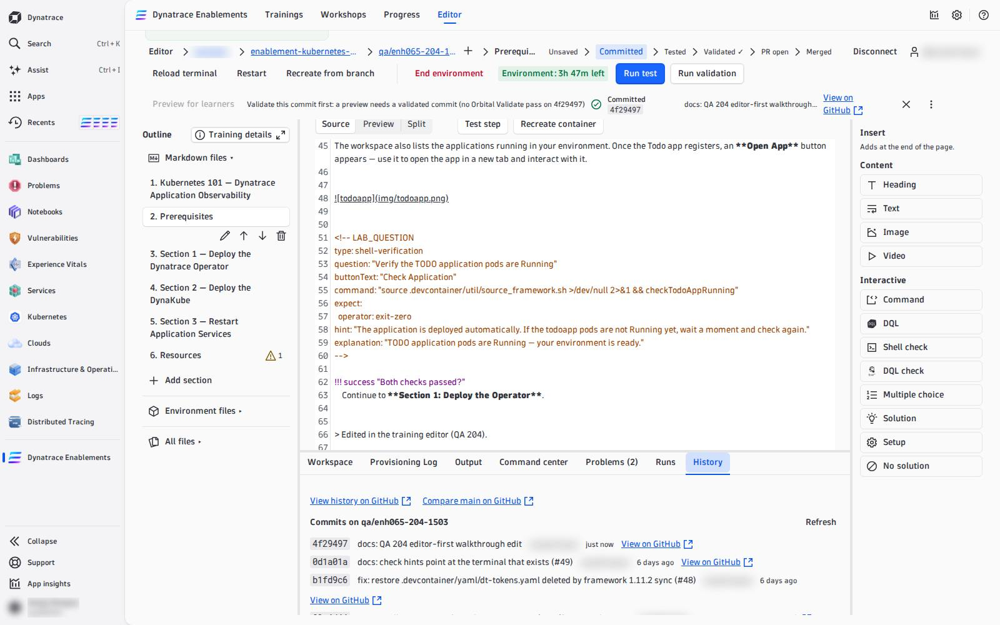
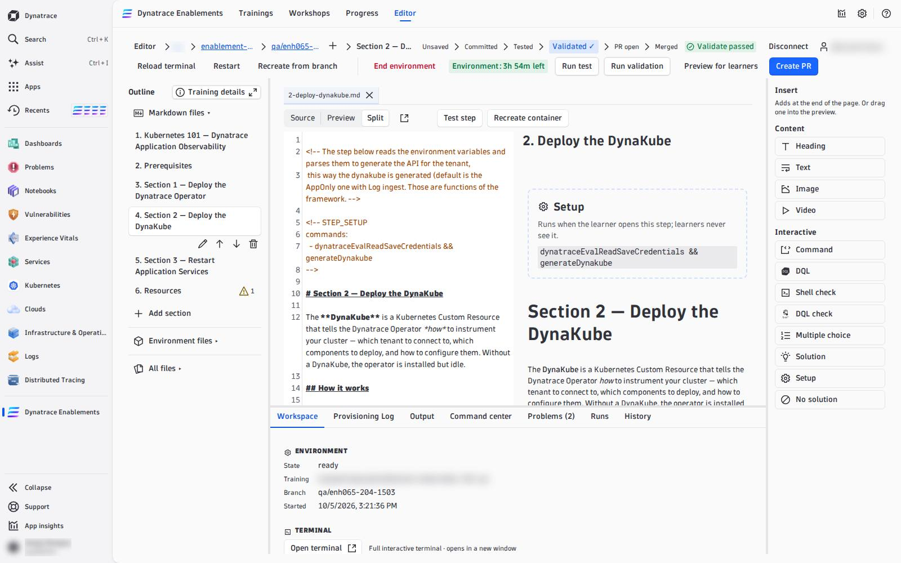
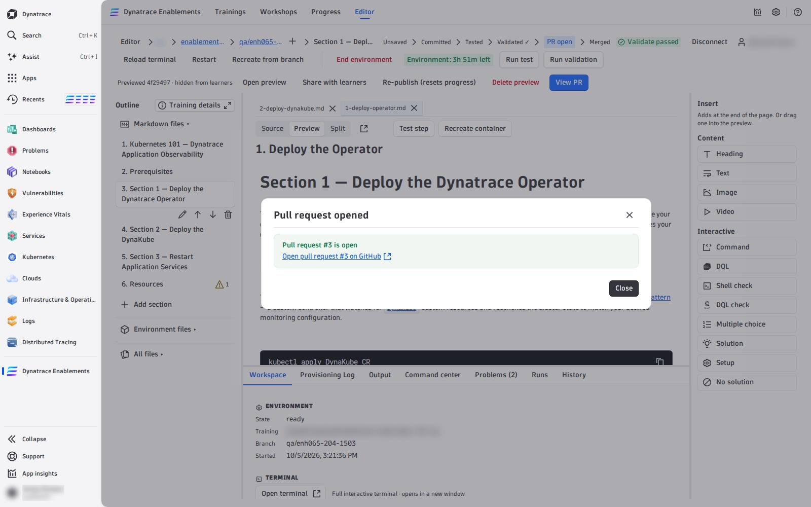

# 06 — Commit and Open a PR

Your edits live in this browser until you commit them. A commit puts them on your branch on GitHub; a validated commit can become a pull request into the training's `main`.

---

## Commit

While you have edits, the action row shows **Commit**, **N changed files** and *Saved in browser · 14:02* (the autosave, in this browser only).

**Commit** (or Ctrl/Cmd+S) opens the pending changes: every file marked *added*, *changed* or *deleted*, and a **Commit message**. Type a message — left empty, the commit gets a generated one such as *Edit docs/prerequisites.md* — and press **Commit** (or Enter). The editor commits every changed file to your branch on GitHub, **as you**.

The stage path moves to **Committed**. A commit is never offered without the chance to type a message, and a commit never runs Validate or anything else by itself.

!!! warning "Unsaved edits are only in this browser"
    Another browser or another machine does not see them, and clearing site data loses them. If the editor finds edits kept from an earlier visit it offers **Restore edits** or **Discard…** — Discard asks first, because it deletes the only copy. Commit often.

If the branch moved on GitHub since you opened it (a teammate pushed), the commit is refused and the editor offers to save your edits on a new branch, so nothing is lost.

## History

The **History** tab lists the branch's newest commits (sha, message, author, time, **View on GitHub**), with **View history on GitHub**, **Compare main on GitHub** and, once one exists, the pull request. GitHub is the diff viewer: every link opens a new tab.

## Validate the commit

**Create PR** needs the commit at the head of your branch to be **Validated ✓**: press **Run validation** (see [04 — Write and Test Steps](write-and-test.md#prove-it-from-scratch-run-validation)). It rebuilds a fresh environment from that commit and runs the whole training. While it runs, Commit is locked, so the commit being validated is the commit you publish.

A pass marks the commit on GitHub (an *Orbital Validate* check run) and the stage path reads **Validated ✓**. Every later commit has to be validated again.

## Open the pull request

With the head validated and no errors in **Problems**, the primary button reads **Create PR**. It opens a dialog:

- **Title** — editable, default *Publish &lt;branch&gt;*;
- **Base** — the repository's default branch (shown, not editable);
- **Notes** — optional, placed before the report;
- **Report** — appended automatically: the last validation, step by step. Quizzes are listed as *not verified*: no automation can answer them.

The pull request is opened **as you**, from your branch into `main`. The stage path reads **PR open** and the button becomes **View PR**.

What blocks it, and what it says:

| The button reads | Why |
|---|---|
| *N problems block publishing* | errors in **Problems** — choosing it opens the tab |
| *Commit first: …* | unsaved edits |
| *Validate this commit first: no Orbital Validate pass on `abc1234`* | the head is not validated |

## Review and merge

The pull request is reviewed and merged on GitHub, like any other. For a training in **dynatrace-wwse**, the repository's own checks run on it (the integration test builds the environment). After the merge, the stage path reads **Merged** — and the training in the app still shows the **old** content until it is refreshed: see [07 — Test as a Learner](test-as-learner.md) and [Publish & Ship](06-test-publish-ship.md).

<!-- LAB_NO_SOLUTION: editor walkthrough — nothing in the environment changes -->

- [07 — Test as a Learner :octicons-arrow-right-24:](test-as-learner.md)

