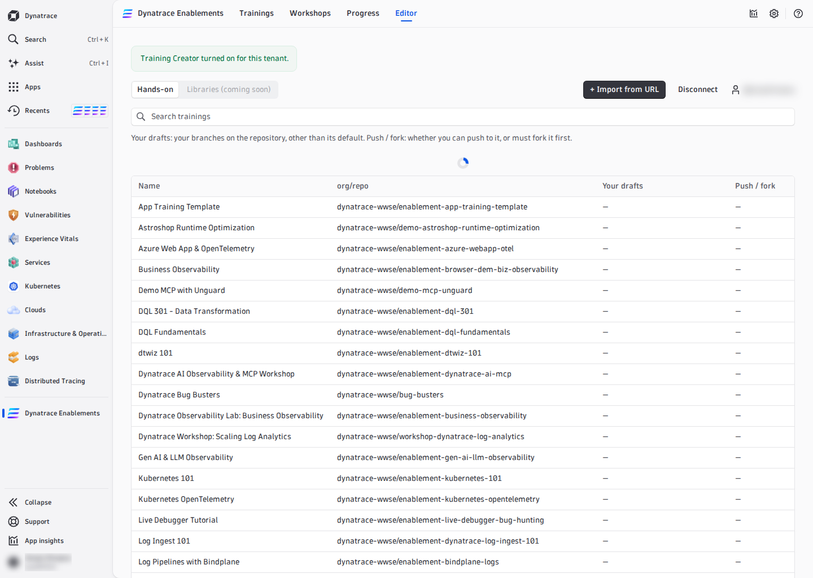
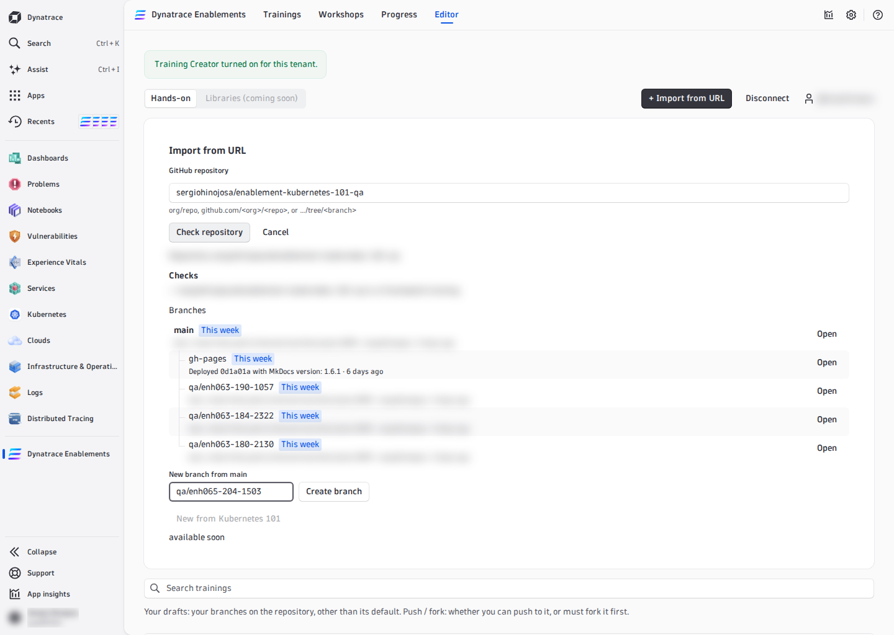
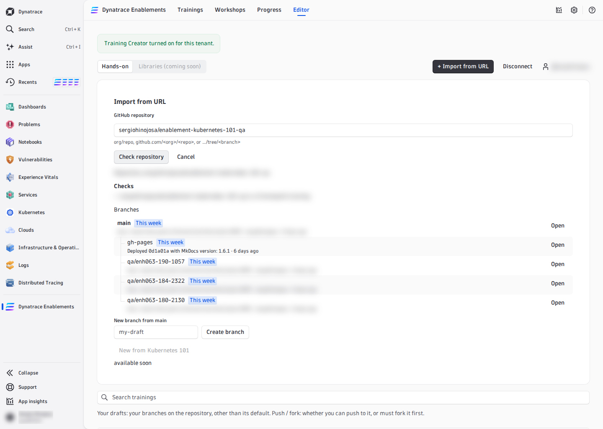
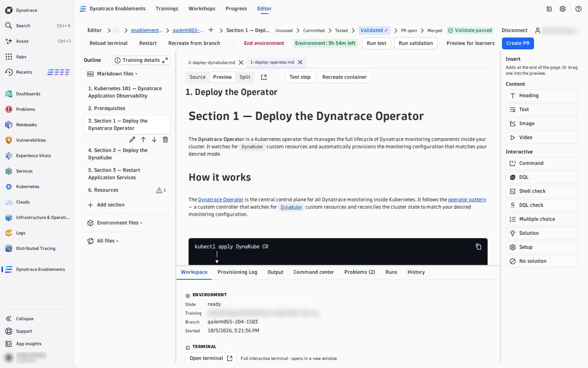

# 01 — Open or Fork a Training

Open **Editor** in the app's header. The first page is the **entry selector**: every hands-on training of the tenant, and the way to bring in one that is not there yet.

---

## The trainings table

| Column | What it tells you |
|---|---|
| **Name** | the training's title |
| **org/repo** | its GitHub repository — a fork and its upstream are two rows |
| **Your drafts** | your branches on the repository, other than its default branch |
| **Push / fork** | **Push** when you can commit to it, **Fork** when you must fork it first |

The search box matches the name or `org/repo`. Above the table, **Your running environments** lists every environment you already have running, each with **Open** — it takes you straight back to that branch, attached to its environment.

## Open a branch you can push to

Click the row (or press Enter on it). The panel lists the repository's branches, each with **Open**, and **New branch from main** with **Create branch**.

**Always work on a branch, never on `main`.** Type a name such as `docs/my-first-step` and press **Create branch**: the branch is created on GitHub at once and the editor opens on it.

Later, inside the editor, the **+** next to the branch name in the breadcrumb (**New branch…**) does the same from the branch you are on.

## Fork a training you cannot push to

When the row says **Fork**, the panel offers two ways:

- **Install App on &lt;owner&gt;** — if you own the organization (or can ask its owner), install the editor's GitHub App there. You can then push to the repository's branches directly.
- **Fork** (or **Fork to my account** under a repository you *can* push to) — a copy under your GitHub account, opened in the editor. Commits are made as you, on your copy. If you already have a fork, the panel offers **Open my existing fork** instead.

A fork is how you start a **new training from this template**: open *App Training Template*, choose **Fork to my account**, and work on the fork.

## Import a repository by URL

A repository that is not in the table yet: press **+ Import from URL**, enter `org/repo` or `github.com/org/repo` (a `…/tree/<branch>` URL opens that branch), and press **Check repository**. The checklist confirms it is a framework training; then the same branch list, **Open** and **Create branch** appear.

## What you see once a branch is open

| Part | What it is |
|---|---|
| Breadcrumb | **Editor › org › repo › branch › section** — *Editor* goes back to the selector; org, repo and branch open GitHub in a new tab; **+** creates a new branch |
| Stage path | *Unsaved › Committed › Tested › Validated ✓ › PR open › Merged* — where your branch stands |
| Action row | the environment controls, **Run test**, **Run validation**, **Preview for learners**, **Create PR** |
| Outline (left) | **Markdown files** (the steps, in `nav` order, with **Add section** and **Training details**), **Environment files** (`post-create.sh`, `my_functions.sh`, tokens, DynaKube), **All files** |
| Document (middle) | the open files as tabs; **Source / Preview / Split**; **Test step**, **Recreate container** |
| Dock (bottom) | **Workspace**, **Provisioning Log**, **Output**, **Command center**, **Problems**, **Runs**, **History** |
| Insert (right) | the content and interactive blocks you can add to a page |

The **Environment files** part is where the automation lives. **Dynatrace tokens** and **Dynakube** show *View default* (the framework's file, read-only) until you press **Override**, which creates `.devcontainer/yaml/dt-tokens.yaml` or `.devcontainer/yaml/dynakube-config.yaml` in your branch. What goes in them: [Automate the Environment](02-automation.md).

!!! tip "Without GitHub"
    A training can also be opened **read-only** without connecting GitHub: you can read every file and the preview, but not start an environment or commit.

<!-- LAB_NO_SOLUTION: editor walkthrough — nothing in the environment changes -->

- [02 — Start the Environment :octicons-arrow-right-24:](start-environment.md)

