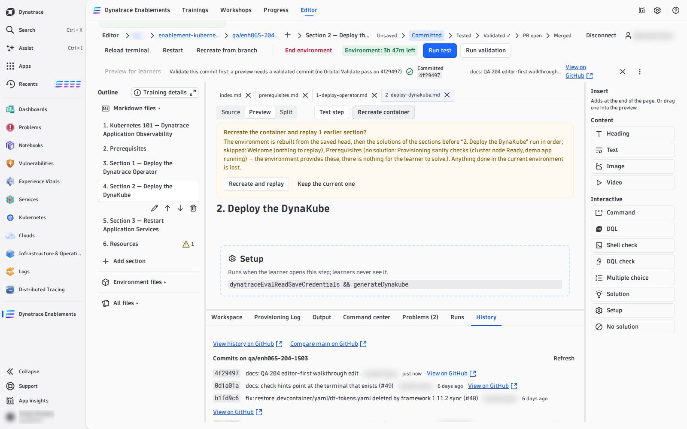
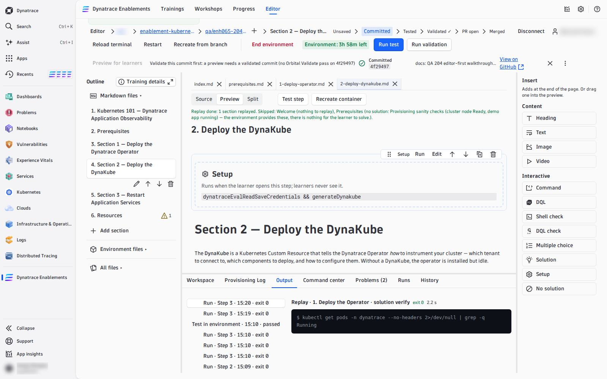

# 05 — Recreate the Environment

A learner's environment is disposable: when they come back, the platform builds a fresh one and **replays the solutions** of every step they completed. The editor lets you do exactly that, at any step — which is how you prove that your solutions really rebuild the state the next step needs, and how you get a clean environment after you experimented in it.

---

## Recreate at a step: **Recreate container**

Open the step you want to land on and press **Recreate container** (next to **Test step**). The editor asks first, naming what it will replay and what it skips:

> *Recreate the container and replay 1 earlier section?*
> The environment is rebuilt from the saved head, then the solutions of the sections before "2. Deploy the DynaKube" run in order; skipped: Welcome (nothing to replay), Prerequisites (no solution: …). Anything done in the current environment is lost.

**Recreate and replay** then:

1. builds a **new** environment from the branch's last commit (`post-create.sh`, `post-start.sh`);
2. waits until it is ready;
3. runs the `LAB_SOLUTION` — its `commands`, then its `verify` — of every step **before** the open one, in `nav` order. The live line reads *Replaying 2/5: &lt;step&gt;*.

The open step itself is not replayed: that is what **Test step** is for. When the replay is done the environment is exactly where a learner who completed the earlier steps would be — press **Test step** on the open step next.

The first solution that fails **stops** the replay and names it:

> *Replay stopped at "Deploy the Operator": its solution (line 4) failed: exit 1. Later sections were not replayed.*

That is the bug a learner would hit on resume, and the nightly test would hit every night: fix that step's solution. A step with a `LAB_NO_SOLUTION` is skipped with its reason; a step that changes the environment but has **no** solution makes every later step impossible to rebuild — see [`LAB_SOLUTION`](04-interactive-blocks.md#lab_solution-how-a-step-solves-itself).

**Cancel** stops the replay. The replay runs in your browser: closing the tab stops it too.

## The other two

| Control | When to use it |
|---|---|
| **Recreate from branch** (action row) | a clean environment from the last commit, **without** replaying anything — after you changed `post-create.sh`, `my_functions.sh` or `dt-tokens.yaml` and committed. With unsaved edits it asks first, then writes them into the new environment |
| **Restart** (action row) | the same environment restarted, nothing rebuilt — when it hangs |

Every recreate is a **new** environment: the **Provisioning Log** tab starts a new log, and a terminal window you opened before belongs to the old one — **Open terminal (new environment)** opens one for the new.

!!! note "Recreate uses your last commit"
    The environment is always built from what is **committed** on the branch. Edits to `post-create.sh` or `my_functions.sh` take effect in a recreate only after you [commit](commit-and-pr.md) them (unsaved page edits are written in afterwards).

<!-- LAB_NO_SOLUTION: editor walkthrough — nothing in the environment changes -->

- [06 — Commit and Open a PR :octicons-arrow-right-24:](commit-and-pr.md)

