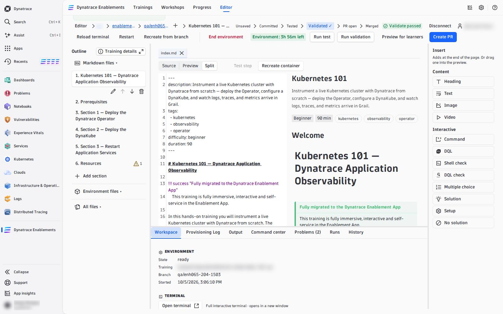
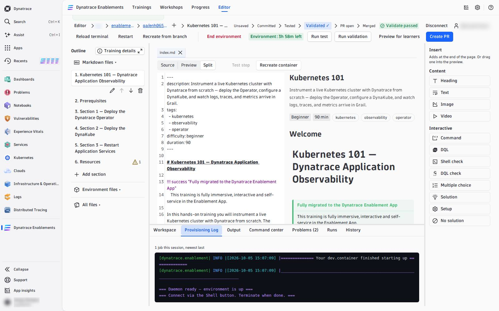

# 02 — Start the Environment

Your branch gets its own **live environment**: the same container a learner gets — the framework image, your `post-create.sh` and `post-start.sh`, the tokens your training declares, minted in your tenant. Opening the editor starts nothing, because an environment costs money; you start it when you need it.

---

## Start it

Press **Start environment** in the action row. The environment is built from your branch's **last commit** (a branch with no commit yet is built from the branch it was created from).

The **Workspace** tab in the dock follows it: *provisioning*, then *ready*. A Kubernetes training like Kubernetes 101 is ready in one to two minutes.

Once it runs, the action row carries its controls:

| Control | What it does |
|---|---|
| **Reload terminal** | the next terminal you open gets a fresh shell — use it after you changed `my_functions.sh` |
| **Restart** | restarts the same container (same environment, the files written into it stay) — use it when the environment hangs |
| **Recreate from branch** | throws the container away and builds a new one from the branch's last commit — see [05 — Recreate the Environment](recreate-environment.md) |
| **End environment** | stops it; **Start environment** comes back |
| *Environment: 3h 57m left* | how long it may still run. After 25 minutes without activity the editor asks **Keep working?**; after 30 idle minutes the environment ends (your edits are safe). While it runs, **Your running environments** in the selector brings you back to it |

## The Workspace tab

| Part | What it shows |
|---|---|
| **Environment** | state, training, branch, when it started |
| **Terminal** | **Open terminal** opens a real shell into the container **in a new browser window** — the framework functions and your `my_functions.sh` are loaded, with autocomplete |
| **Registered apps** | every app your automation exposed (`registerApp`), each with **Open App** in a new window |
| **Variables** | every template variable the editor knows, with its value — `DT_SESSION_ID`, `DT_TENANT`, `JOB_ID`, … — the same ones your DQL checks use |

!!! tip "Allow pop-ups"
    The terminal and the apps open in their own windows. If nothing opens, allow pop-ups for your Dynatrace tenant.

## The Provisioning Log tab

Everything `post-create.sh` and `post-start.sh` printed, for every environment of this session. When provisioning **fails**, the line that names the error is drawn in bold red and repeated under the log — fix the script, commit, and recreate.

What goes into `post-create.sh`, and which framework functions build a cluster, deploy Dynatrace and your apps: [Automate the Environment](02-automation.md).

<!-- LAB_NO_SOLUTION: editor walkthrough — nothing in the environment changes -->

- [03 — Command Center :octicons-arrow-right-24:](command-center.md)

