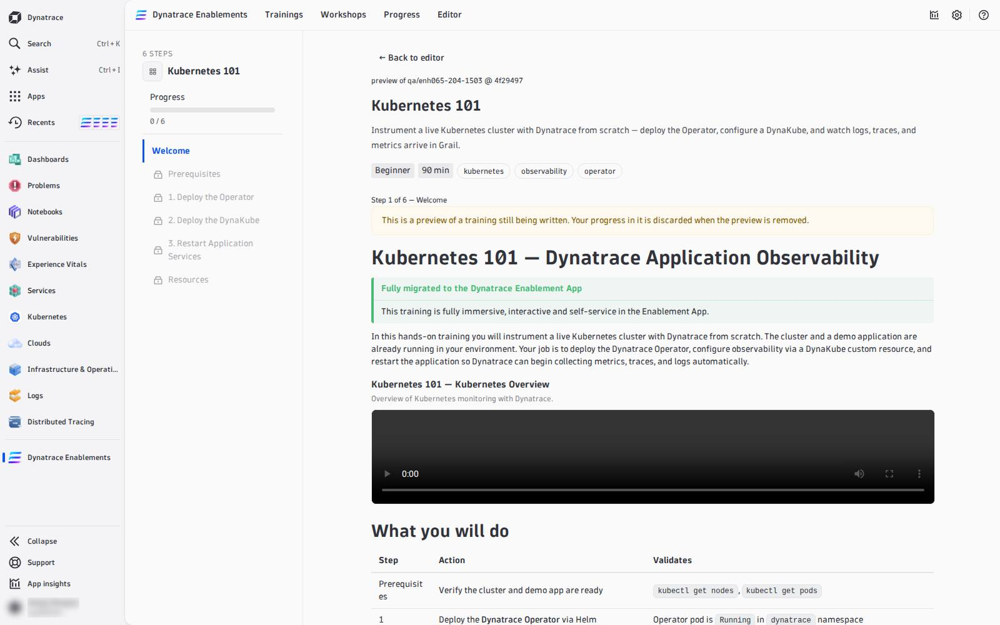

# 07 — Test as a Learner

The editor shows you every step the way a learner sees it, but a learner meets the **whole** training: the catalog card, the environment that starts when they click *Start*, the progress, the assessment. Take it once as a learner before you ask for review, and again after the merge.

---

## Before the merge: **Preview for learners**

**Preview for learners** imports your branch's **committed, validated** head as its own, hidden copy of the training — the main training is never touched. It is offered when:

- there are no errors in **Problems**,
- there are no unsaved edits (*Commit first: a preview imports your committed head*),
- the head is **Validated ✓** (*Validate this commit first: a preview needs a validated commit*).

Once imported, the action row reads **Previewed `abc1234`**, with:

| Control | What it does |
|---|---|
| **Open preview** | opens the copy in the learner's lab viewer: **Start** an environment, run every check, answer every quiz, finish the assessment. **← Back to editor** (or the browser's Back) returns to your branch |
| **Refresh preview** | after a new validated commit: replaces the copy with it, so Open preview shows your latest changes |
| **Re-publish (resets progress)** | imports the same commit again from the start, wiping your progress in the copy |
| **Share with learners** / **Hide from learners** | a registered trainer can list the copy in the tenant's catalog so colleagues can take it before it is published; hidden by default |
| **Delete preview** | deletes the copy and everyone's progress in it; the training and the branch are not touched |

The copy is titled *&lt;training&gt; · preview · &lt;branch&gt; · &lt;sha7&gt;*, and a learner who opens it is told that it is a preview and that its progress is discarded when it is removed.

Take it as a learner, start to finish:

- [ ] the catalog card shows the description, tags, difficulty and duration from **Training details**;
- [ ] the environment starts and every **Verify** button turns green once its step is done — and stays red before;
- [ ] every DQL check finds *your* data only (`{{DT_SESSION_ID}}`);
- [ ] every quiz has exactly one right answer, and the explanation helps;
- [ ] the final assessment loads and scores.

## After the merge: refresh, then take the real one

A merge to `main` does **not** update a training that is already in the app: the app imports the Markdown at a commit. After the merge:

1. In the app, open **Administration** and press **Refresh content** (a dynatrace-wwse training) — or **Import lab** with the same repository URL (a training you imported yourself). Details: [Publish & Ship](06-test-publish-ship.md#after-every-publish-refresh-the-app-and-verify).
2. Open the training from **Trainings** and go to every step you changed: the text, the checks, the solution and, on the last page, the assessment.
3. Delete the preview copy (**Delete preview** in the editor) once the real training is current.

Then run it once as the **trainer** of a workshop, with a second account — ideally on a second tenant — so you see both sides: the roster and join code, the live board, chat and questions, and *Run solution* on a stuck learner.

<!-- LAB_NO_SOLUTION: editor walkthrough — nothing in the environment changes -->

- [Reference: How It Works :octicons-arrow-right-24:](01-how-it-works.md)
- [Publish & Ship :octicons-arrow-right-24:](06-test-publish-ship.md)

