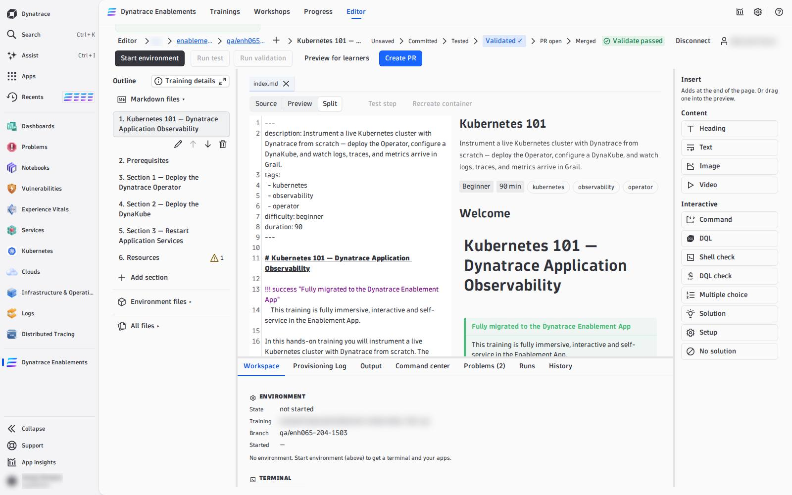
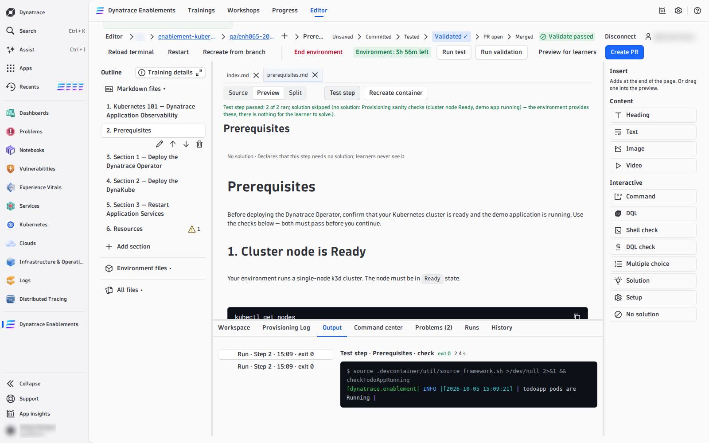

# 04 — Write and Test Steps

A training is Markdown pages — one step per page in `mkdocs.yaml`'s `nav` — with interactive blocks between the prose. You write them in the document pane and test each one against your environment before you commit.

---

## Write

Pick a step in the **Outline** (left). Above the document, three views:

| View | What you get |
|---|---|
| **Source** | the raw Markdown, with line numbers — every block's YAML is editable here |
| **Preview** | the step the way a learner sees it, with the real buttons, quizzes and solution panels. Click a paragraph to edit its text in place; each block has its own form (pencil) and can be moved, duplicated or removed |
| **Split** | both side by side; scrolling one follows the other |
| ↗ **Open preview in new window** | the Preview in its own browser window, live as you type — put it on a second screen while you write in Source |

**Insert** (right) adds content where your cursor last was — or drag an item into the Preview:

| Group | Items |
|---|---|
| Content | Heading, Text, Image, Video |
| Interactive | **Command**, **DQL**, **Shell check**, **DQL check**, **Multiple choice**, **Solution**, **Setup**, **No solution** |

Each interactive item is a well-formed block with placeholders; its form asks for the fields. What every block does and every field means: [Interactive Blocks](04-interactive-blocks.md). The shape a good step follows — content, check, solution: [Lesson Anatomy](03-lesson-anatomy.md). A complete step that uses every block: [Example Lesson](05-example-lesson.md).

In the Outline, **Add section** creates a new step (a page plus its `nav` entry), and each section can be renamed, moved up or down, or deleted. **Training details** edits the catalog card: description, tags, difficulty, duration. The scripts that build the environment are under **Environment files**.

Your edits are kept **in this browser** as you type (*Saved in browser · 14:02*) — nothing reaches GitHub until you [commit](commit-and-pr.md). Each open file with unsaved edits ends with `●` in its tab.

## Problems

The **Problems** tab checks every page as you type, the same rules the import uses:

- **Errors** — a block the import would drop (bad YAML, missing `expect`, an unknown variable in DQL, a quiz without a valid `correct`), a hands-on step without a solution, a placeholder never filled in. Errors block **Preview for learners** and **Create PR**, never a commit.
- **Warnings** — a step with neither a `LAB_SOLUTION` nor a `LAB_NO_SOLUTION`, an image without alt text, a page not in `nav`.

**Go to** (or F8) jumps to the line. The Outline shows a ⚠ count on every section with problems.

## Test one step: **Test step**

Open a step and press **Test step** (next to Source / Preview / Split). It runs the step the way a learner meets it, in order: its `STEP_SETUP`, its `LAB_SOLUTION` commands, the solution's `verify`, then every shell and DQL check on the page. It stops at the first item that fails and names it, with its line:

> *Test step failed at solution verify (line 12): exit 1.*

Every command and its output lands in the **Output** tab, and each block in the Preview shows its own result. A single block can also be run on its own with its **Run** (or Ctrl/Cmd+Enter on the focused block); a shell check in the Preview has its learner **Verify** button, live once the environment is ready.

!!! tip "Check that a check can fail"
    A check that never fails proves nothing. Before you trust one, run it in the [Command center](command-center.md) **before** the step's solution ran — it must fail — then press **Test step**: the solution runs and the same check must pass. If the environment already holds the step's result, [recreate it](recreate-environment.md) at that step first.

## Test the whole training: **Run test**

**Run test** runs **every** step's checks in the environment as it is now — your unsaved edits are written into it first. Nothing is written to GitHub. The **Output** tab shows each step, its setup, solution, verify and checks with their times; the stage path marks **Tested** when it passes.

## Prove it from scratch: **Run validation**

**Run validation** is the real gate. It rebuilds a **fresh** environment from your **last commit** and runs the whole training from the start: every setup, solution and check, in order — what the nightly test does. A pass marks that commit **Validated ✓** on GitHub, which **Create PR** requires. It needs a commit, so it reads *Commit first* while you have unsaved edits.

| | Test step | Run test | Run validation |
|---|---|---|---|
| runs | the open step | every step | every step |
| on | the environment as it is, with your unsaved edits | the environment as it is, with your unsaved edits | a fresh environment, from your last commit |
| marks the commit | never | never | **Validated ✓** on success |

While it runs, the **Output** and **Runs** tabs show it step by step — setup, solution, verify, checks — with **Go to block** on a failure. The Runs tab belongs to this editor session; after a reload, the commit's result is still on GitHub (the *Orbital Validate* check run) and in the stage path.

<!-- LAB_NO_SOLUTION: editor walkthrough — nothing in the environment changes -->

- [05 — Recreate the Environment :octicons-arrow-right-24:](recreate-environment.md)

